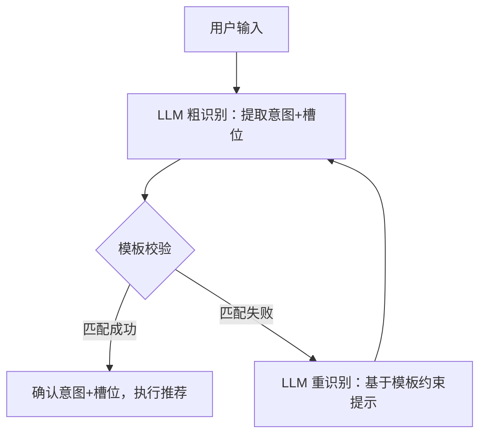

### 意图理解
1. 模板化定义意图边界：用 HassIL 风格的模板覆盖推荐场景的核心意图，把模糊的用户需求转化为「意图 + 槽位」的结构化数据；
2. 配置化管理规则：通过 YAML 配置意图、槽位列表、上下文约束，无需修改代码即可扩展推荐意图（比如新增 “旅游推荐” 意图）；
3. LLM + 模板混合识别：用 LLM 处理自然语言的灵活性，用模板保证意图识别的精准性，兼顾「泛化能力」和「推荐精准度」。

```
import re
import yaml

# 1. 加载 HassIL 风格的意图配置
def load_intent_config(config_path):
    with open(config_path, "r", encoding="utf-8") as f:
        return yaml.safe_load(f)

intent_config = load_intent_config("recommend_intents.yaml")

# 2. 模板匹配核心函数（简化版 HassIL 匹配逻辑）
def match_intent_template(user_input, intent_templates, slot_lists):
    """
    校验 LLM 提取的意图+槽位是否匹配模板
    :param user_input: 用户原始输入
    :param intent_templates: 意图模板列表
    :param slot_lists: 全局槽位列表
    :return: 匹配的意图+槽位，或 None
    """
    # 简化版：将模板中的槽位/规则替换为正则表达式
    for intent, config in intent_config["intents"].items():
        for sentence in config["data"][0]["sentences"]:
            # 替换扩展规则（比如 <recommend_request_rule> → 对应的模板）
            for rule_name, rule_content in intent_config["expansion_rules"].items():
                sentence = sentence.replace(f"<{rule_name}>", rule_content)
            # 替换槽位列表为正则（比如 {category_list} → (无线耳机|护肤品|零食)）
            for list_name, list_config in slot_lists.items():
                list_values = [item["in"] if isinstance(item, dict) else item for item in list_config["values"]]
                sentence = sentence.replace(f"{{{list_name}}}", f"({'|'.join(list_values)})")
            # 替换可选内容 [A] → (A)?
            sentence = re.sub(r"\[(.*?)\]", r"(\1)?", sentence)
            # 替换备选内容 (A|B) → 保持正则格式
            sentence = re.sub(r"\((.*?)\|(.*?)\)", r"(\1|\2)", sentence)
            
            # 匹配用户输入
            if re.search(sentence, user_input):
                # 提取槽位（简化版：这里可结合 LLM 提取的槽位）
                return {"intent": intent, "matched_template": sentence}
    return None

# 3. 实际使用示例
user_input = "推荐一款性价比高的无线耳机，百元内的"
# LLM 粗识别结果
llm_result = {
    "intent": "RecommendItem",
    "slots": {"category": "无线耳机", "filter": "性价比高", "budget": "百元内"}
}
# 模板校验
matched_result = match_intent_template(
    user_input,
    intent_config["intents"][llm_result["intent"]]["data"][0]["sentences"],
    intent_config["lists"]
)
if matched_result:
    print("意图有效，执行推荐：", llm_result)
else:
    # 让 LLM 基于模板约束重新识别
    prompt = f"你的识别结果不符合模板规则，请参考以下模板重新识别：{intent_config['intents']['RecommendItem']['data'][0]['sentences']}"
    # 重新调用 LLM...
```