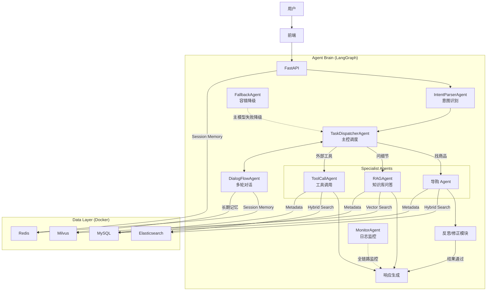

# 电商推荐 Agent 项目技术方案

## 1. 项目概述
本项目旨在开发一个基于大语言模型（LLM）的智能电商导购 Agent。该 Agent 能够通过多轮对话理解用户意图，提供个性化的商品推荐、穿搭建议，并支持对收藏夹商品进行深度问答。

项目核心目标是构建一个具备**意图识别**、**检索增强生成 (RAG)**、**自我反思与规划**以及**自动化评测**能力的 AI 应用，模拟真实的金牌导购员体验。

## 2. 系统工作流程 (System Workflow)

系统通过以下 8 个阶段处理用户请求，确保从意图识别到最终响应的连贯性与准确性：

1.  **用户请求入口**：用户通过网页端或 API 接口发起自然语言请求，系统需具备对复杂意图（商品检索、穿搭推荐、商品问答等）的解析能力。
2.  **意图识别与任务分类**：`IntentParserAgent` 对原始输入进行归类，判断任务类型（检索型、问答型、规划型、对话型），提取关键词、参数信息及上下文状态。
3.  **主控调度智能体分发**：`TaskDispatcherAgent` 根据任务类型、上下文信息与系统资源状态，动态选择合适的子智能体或工具服务，支持异步并发调度、优先级排序与上下文绑定。
4.  **子智能体任务执行**：被调度的子智能体（导购 Agent、RAG Agent、ToolCallAgent 等）根据指令执行子任务，输出结构化结果或自然语言回答，过程中可包含工具链联动或信息补全。
5.  **上下文更新与结果整合**：子任务完成后，结果写入统一上下文。若为多阶段复合任务（如"西藏旅游全套装备"），由主控智能体进行结果整合与逻辑判断并发起下一轮任务；若为单轮任务，则直接进入响应阶段。
6.  **多模型动态调用与回退机制**：`FallbackAgent` 监控模型接口状态，支持基于任务复杂度自动切换模型（如 DeepSeek-V3 / GPT-4o-mini）。若主模型响应失败，自动触发容错机制进行降级或备选路径调用。
7.  **最终响应生成**：根据所有子任务输出生成统一响应文本，进行语言润色与格式化，通过原通道返回给用户，并记录对话历史与任务日志。
8.  **会话记忆与持久化管理**：将对话内容、任务状态与中间数据写入短期缓存（Redis）与长期向量存储（Milvus）中，用于后续上下文重建与个性化处理。

---

## 3. 核心智能体角色定义 (Core Agent Roles)

系统由以下 7 个专业化智能体协作组成：

| 智能体名称 | 英文定义 | 核心职责 |
| :--- | :--- | :--- |
| **主控调度智能体** | **TaskDispatcherAgent** | 系统中枢。负责任务路由、子智能体分发、上下文维护与流程追踪，具备多线程调度与容错策略。 |
| **意图识别智能体** | **IntentParserAgent** | 语义分析。对原始输入进行归类，提取关键参数（预算、品类、场景），为调度提供依据，要求响应速度极高。 |
| **检索问答智能体** | **RAGAgent** | 知识库问答。结合 Embedding 向量搜索与 LLM 生成，支持基于商品说明书、评论、FAQ 的检索增强生成。 |
| **工具调用智能体** | **ToolCallAgent** | 功能执行。管理与调用外部工具（ES 商品检索、MySQL 查询、个性化排序等），支持 LangChain 函数调用标准。 |
| **多轮对话智能体** | **DialogFlowAgent** | 上下文维护。确保对话连贯性，结合短期（Redis）与长期（Milvus）记忆机制，支持对话轮次管理与用户偏好适配。 |
| **模型切换与容错智能体** | **FallbackAgent** | 高可用保障。监控模型接口状态，在主模型调用失败时自动降级至备用模型，记录失败日志。 |
| **日志监控与评估智能体** | **MonitorAgent** | 质量控制。记录交互日志、模型输出、耗时等指标，并提供结果评估能力（对接 Ragas），支撑系统性能测试。 |

---

## 4. 核心功能模块 (Core Capabilities)
系统整合了基础导购与大厂级进阶能力，包含以下八大核心模块：

### 4.1 基础导购与推荐
1.  **智能导购对话 (Conversational Shopping)**: 解析用户模糊需求（如"买个相机"），通过反问澄清需求（预算、用途），最终生成结构化查询。
2.  **组合推荐 (Outfit/Bundle Recommendation)**: 处理跨品类推荐请求（如"男生穿搭"），理解商品间的搭配逻辑。
3.  **个性化引擎 (Personalization)**: 基于用户历史行为（购买、浏览、点赞）调整推荐结果的排序。
4.  **商品深度问答 (Product RAG)**: 针对特定商品（收藏夹）的说明书、评论、参数进行基于事实的问答。
5.  **主动交互 (Proactive Engagement)**: 生成"猜你想问"或相关后续问题，引导用户探索。

### 4.2 进阶智能交互 (Advanced Interaction)
6.  **反思与自我修正 (Self-Reflection & Correction)**:
    *   在推荐前引入 Reflection Step。当检索结果为空或用户需求不合理（如"200元买全新单反"）时，Agent 能自动调整策略或引导用户，避免幻觉。
    *   解决"人工智障"问题，显著提升 Agent 的鲁棒性。
7.  **复杂任务规划 (Task Planning / Decomposition)**:
    *   针对宏大目标（如"去西藏旅游全套装备"），使用 ReAct 或 Plan-and-Solve 模式自动拆解子任务（查天气 -> 选衣物 -> 选药品 -> 选器材）。
    *   处理 Long-horizon Tasks，体现 Agent 的推理规划能力。

### 4.3 质量保障与评测
8.  **模拟用户评估 (User Simulation & Eval)**:
    *   构建 User Simulator Agent 扮演挑剔用户与 Shopping Agent 对战。
    *   使用 Ragas 框架建立自动化评测管线，量化评估准确率、召回率和幻觉率，作为项目质量的"绝杀"证明。

## 5. 技术栈选型 (Tech Stack)

为了满足大厂 AI 应用开发的标准，本项目采用主流且具备生产级能力的开源技术栈：

### 5.1 核心 AI 框架
*   **开发语言**: **Python 3.10+** (AI 领域标准语言)
*   **Agent 编排框架**: **LangChain** 或 **LangGraph**
    *   *理由*: LangGraph 适合构建有状态、循环的多 Agent 系统（Stateful Multi-Agent），完美支持**反思**与**规划**所需的循环控制流。
*   **LLM 模型服务**: 
    *   **DeepSeek-V3**: 逻辑推理能力强，性价比高，作为主大脑。
    *   **OpenAI GPT-4o / GPT-4o-mini**: 备选方案（FallbackAgent 降级目标）。
*   **Prompt 管理**: **LangSmith** (用于调试 Traces 和监控)

### 5.2 数据与检索 (Hybrid RAG Architecture)
本项目采用 **Elasticsearch + Milvus + MySQL** 的混合架构，充分发挥各组件优势：

*   **检索引擎**: **Elasticsearch (v8+)**
    *   *用途*: **商品检索引擎** (Recall Stage)。
    *   *能力*: 利用 ES 的 **Hybrid Search** (Keyword + KNN Vector)，处理带有过滤条件（价格区间、品牌、库存状态）的精准商品查询。
*   **向量数据库**: **Milvus (Docker Standalone)**
    *   *用途*: **非结构化知识库** (Knowledge Base) 与**长期记忆存储**。
    *   *能力*: 存储海量非结构化文本块 (Chunks)，如用户评论、商品说明书、FAQ，以及历史对话向量，用于上下文重建与个性化处理。
*   **关系型数据库**: **MySQL 8.0**
    *   *用途*: **元数据真理源** (Source of Truth)。
    *   *内容*: 存储用户画像 (Users)、商品基础信息 (Products)、订单 (Orders)、交互日志 (Interaction Logs)。
*   **缓存与会话**: **Redis**
    *   *用途*: **短期会话记忆与热数据**。
    *   *内容*: 存储多轮对话的 Context (Session Memory) 和热门商品详情缓存。

### 5.3 后端服务 (Backend)
*   **Web 框架**: **FastAPI** (异步高并发)
*   **数据验证**: **Pydantic**

## 6. 系统架构设计

## 7. 关键技术难点与解决方案

| 难点 | 解决方案 | 涉及技术 |
| :--- | :--- | :--- |
| **幻觉 (Hallucination)** | 1. 严格的 Tool Use 限制。 2. **Self-Reflection**: 强制 Agent 检查检索结果是否为空，若为空则触发修正逻辑。 | LangGraph Cycle, Validator |
| **复杂需求理解** | 引入 **Task Decomposition**，将一句话拆解为多个搜索步骤。 | ReAct / Plan-and-Solve |
| **精准检索 vs 语义理解** | 采用 **Hybrid Search**：用 ES 处理"5000元以下"(精准过滤)，用 Vector 处理"复古风"(语义匹配)。 | ES Hybrid Query |
| **模型不可用** | **FallbackAgent** 监控主模型状态，自动降级至备用模型，记录失败日志。 | FallbackAgent, 多模型路由 |
| **多轮上下文丢失** | **DialogFlowAgent** 结合 Redis 短期记忆与 Milvus 长期记忆，支持跨会话上下文重建。 | Redis, Milvus, DialogFlowAgent |
| **评测缺失** | 建立 **LLM-as-a-Judge** 机制，用强模型打分弱模型，实现自动化回归测试；**MonitorAgent** 实时记录耗时与质量指标。 | Ragas, TruLens, MonitorAgent |

## 8. 开发路线图 (Roadmap)

1.  **Phase 1: 基础建设 (MVP)**
    *   Docker 环境搭建 (MySQL, ES, Milvus, Redis)。
    *   FastAPI + LangChain 环境搭建。
    *   Mock 数据生成与入库。
2.  **Phase 2: 核心与进阶能力 (Core + Advanced)**
    *   实现 ES 商品检索工具（ToolCallAgent）与 Milvus 知识库检索工具（RAGAgent）。
    *   引入 **LangGraph** 实现带有**反思 (Reflection)** 机制的对话循环。
    *   开发 **IntentParserAgent** 与 **TaskDispatcherAgent** 实现多智能体调度。
    *   开发**任务规划**模块处理复杂查询。
    *   接入 **DialogFlowAgent** 实现多轮上下文管理。
    *   接入 **FallbackAgent** 实现模型容错降级。
3.  **Phase 3: 评测与优化 (Eval & Opt)**
    *   构建 User Simulator。
    *   跑通 Ragas 评测流程。
    *   完善 **MonitorAgent** 全链路日志与性能指标采集。
